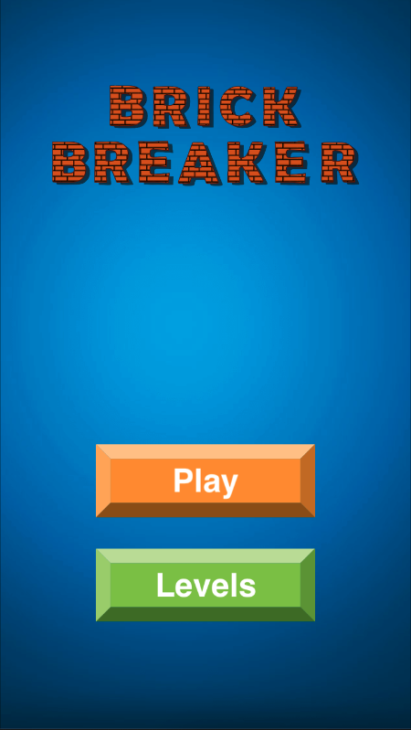
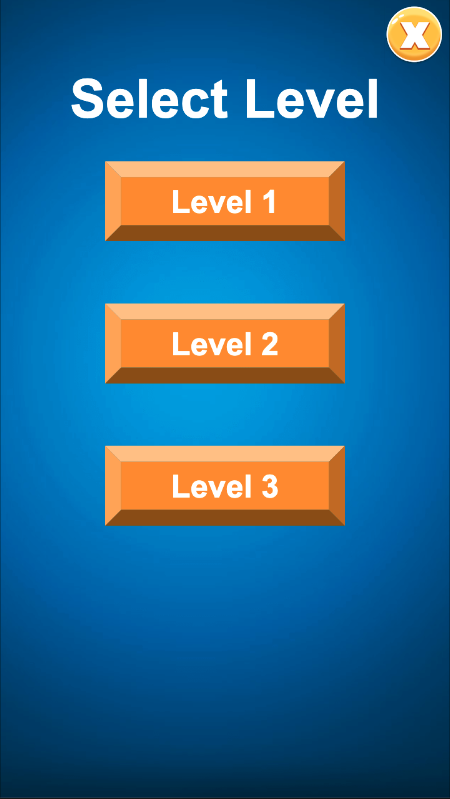
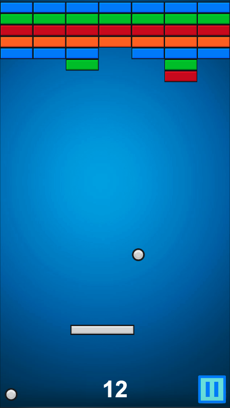
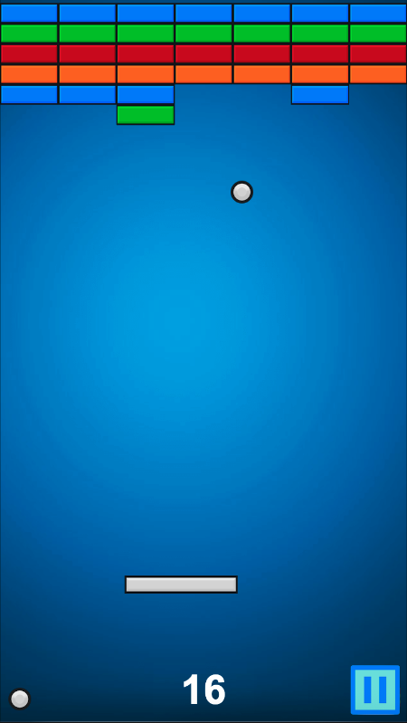

# Brick Breaker 🎮

Classic **Brick Breaker game** developed using **Cocos Creator**.  
Bounce the ball using the paddle, break all the bricks, and avoid losing all lives.

The game supports **multiple levels generated from JSON data**, making it easy to design and expand levels.

---

## 🕹 Features

- Simple and intuitive gameplay  
- Multiple levels with increasing difficulty  
- Score tracking system  
- Lives system (3 lives by default)  
- Responsive for desktop and mobile  
- Levels loaded dynamically from **JSON data**  
- **TypeScript calling Java functions (Android native bridge)**
- Built using **Cocos Creator (2D Game Engine)**

---

## 🚀 How to Play

1. Open the project in **Cocos Creator**
2. Open the **Main Scene**
3. Run the game

### Controls

Desktop  
- Move paddle using **mouse**

Mobile  
- Move paddle using **touch**

### Objective

- Bounce the ball using the paddle  
- Break all bricks to clear the level  
- Avoid losing all lives  

---

## 📸 Screenshots









---

## 🧩 Level System (JSON Based)

Levels are generated using a **JSON configuration file**.

Each number in the grid represents a **brick type**.

Example level data:

```json
{
  "levels": [
    [
      [6,6,6,6,6,6,6],
      [2,2,2,2,2,2,2],
      [3,3,3,3,3,3,3],
      [4,4,4,4,4,4,4],
      [1,1,1,1,1,1,1],
      [5,5,2,6,2,5,5],
      [3,3,5,6,5,3,3]
    ]
  ]
}
```

### Brick Type Meaning

| Number | Brick Type |
|------|-------------|
| 1 | Normal Brick |
| 2 | Strong Brick |
| 3 | Bonus Brick |
| 4 | Speed Brick |
| 5 | Hard Brick |
| 6 | Special Brick |

Advantages of JSON Level System:

- Easy to create new levels  
- Level design separated from game logic  
- Flexible level layout system  

---

# 🔗 TypeScript → Java Native Call (Android)

This project demonstrates **calling native Android Java functions from TypeScript using Cocos Creator's native bridge**.

This allows integration with:
- Android SDK
- Ads SDK
- Native device features
- Platform-specific functionality

---
## 🛠 Technology Used

- **Cocos Creator v3.x**
- **TypeScript**
- **JSON-based level configuration**
- **Android Java native integration**

---

## 📥 Installation

Clone the repository:

```
git clone https://github.com/priyesh128/brick-breaker.git
```

Open the project in **Cocos Creator** and run the **Main Scene**.

---

## 👨‍💻 Author

**Priyesh Patel**

Senior Game Developer  
Specializing in **Cocos Creator, Cocos2d-x, and HTML5 Game Development**

Ahmedabad, India

---

⭐ If you like this project, please **star the repository**.
